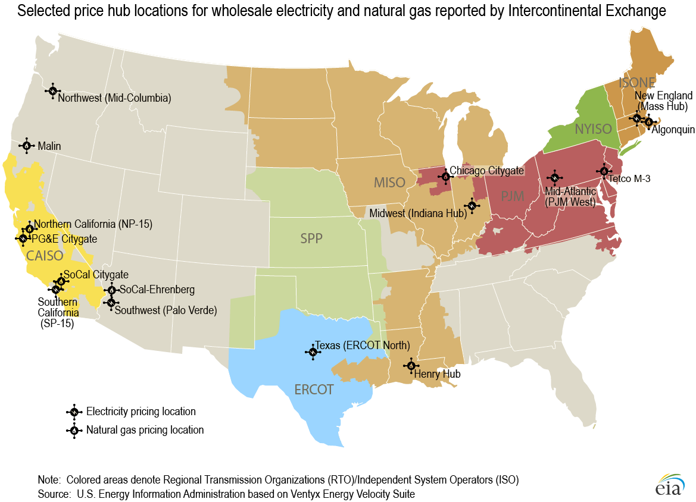
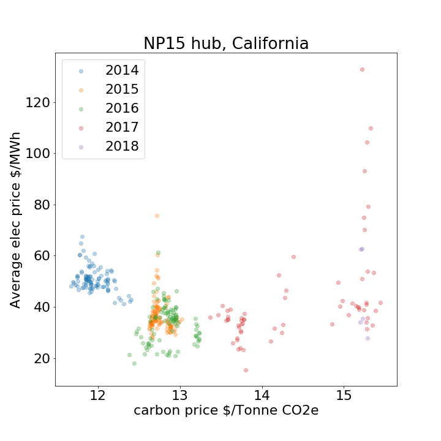
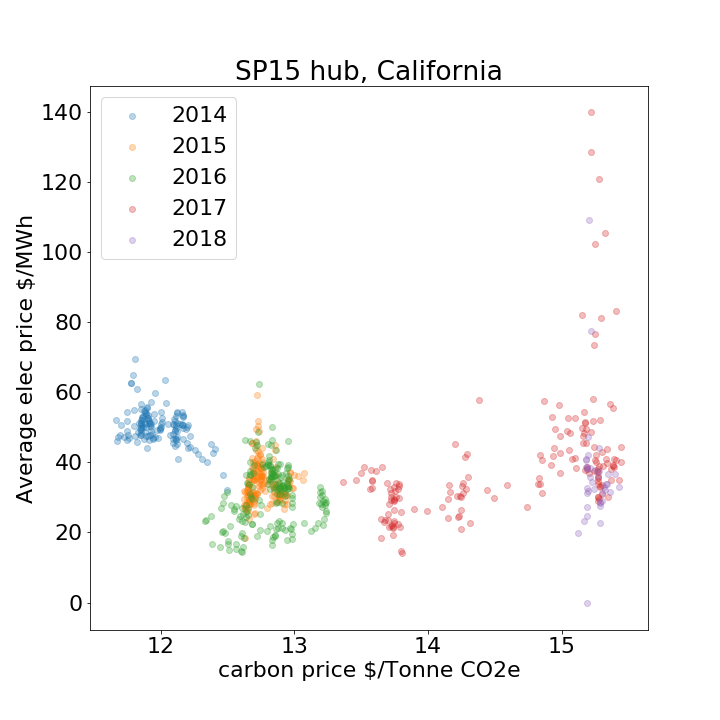

This repository includes

find the link between carbon price, electricity price, load demand

# Map of USA electricity markets

    

# Electricity price and carbon prices

    
    

# data for benchmark

electricity price
Nord Pool : www.nordpoolspot.com/Market-data1/Downloads/Historical-Data-Download1/Data-Download-Page

British market :
www.bmreports.com

UK APX power exchange :
www.apxgroup.com/market-results/apx-power-uk/ukpx-rpdhistorical-data

PJM, ISO-NE :
http://www.gdfsuezenergyresources.com/index.php?id=712,
https://www.iso-ne.com/isoexpress/,
https://www.iso-ne.com/isoexpress/web/reports/pricing/-/tree/lmps-rt-hourly-final,

Electricity price:

Overall: https://www.eia.gov/electricity/wholesale/#history

ISO-NEW ENGLAND : https://www.iso-ne.com/isoexpress/web/reports/pricing/-/tree/ener-mkt-prices

CAISO: I should use trading hub price rather than nodal LMP.

http://www.energyonline.com/Data/GenericData.aspx?DataId=20,
http://oasis.caiso.com/mrioasis/logon.do,

carbon price
https://www.rggi.org/
: Can find only quarter (3 months closing data) not in secondary market (weekly?)

http://calcarbondash.org/

https://markets.businessinsider.com/commodities/historical-prices/co2-emissionsrechte/euro/2.4.2018_2.5.2019

# Note for: 04/27/2019

1. Paper name : "Does California's CO2 price affect wholesale electricity prices in the Western U.S.A.?"
  * Highlight: analyzed CO2 price based on cap and trade program affect to wholesale electricity price in California.
  * Data source : the market price data came from SNL Financial (www.snl.com); electricity wholesale price ($/MWhr), natural gas price ($/MMBtu)
  * Statistical analysis (correlation analysis) shows that that the day-ahead market prices are positively correlated with the day-ahead forecasts of the CO2 price, the natural gas price and PG& E and SCE system loads, but are negatively correlated with the day-ahead forecasts of California's solar generation and hydro conditions. As some of the correlations (e.g., nuclear capacities available and wind energy) are at odds with our expectations, we propose a regression-based approach below to esti- mate the CO2 price's effects
  * method: regression with random error

  

2. Paper name :"Carbon trading’s impact on California’s real-time electricity market prices"
  * same as paper 1 but the difference is this paper concern on real-time prices.

3. Paper name : "DISTRICT HEATING SYSTEMS UNDER HIGH CARBON PRICES: THE ROLE OF THE PASS-THROUGH FROM EMISSION PRICES TO POWER PRICES Sebastian"
  * Run linear programming (LP), mix-integer linear (MIP) to solve unit commitment of district heating system operators (DHSO) with pass through from emission price to electricity price.
  * The result shows that the model can reduce cost pass through from around 1.1 at emission prices around 10 euros/t CO2 eq to approximately 0.78 euros/t CO2 eq.
  * As results of (i) a “fuel switch” triggered by rising emissions prices, (ii) a changing pattern of co-generation outputs and (iii) an increase in the overall fuel efficiency.
  * Idea to do more : how to calculate estimated pass through?

  

# Note for: 04/29/2019

1. internet : "https://www.journals.uchicago.edu/doi/full/10.1086/688486"
  * this paper estimated the degree of allowance cost pass-through to hourly wholesale electricity prices in Germany.
  * model used in this paper: linear regression
  * data used: hourly spot market data
  * brief finding: I find that allowance costs are passed through to electricity prices completely (or nearly completely) on average, but that the degree of pass-through varies over the load curve.
  * allowance cost pass-through is lower during hours of low demand and higher during hours of high demand, and that pass-through of allowance costs varies by much more than pass-through of fuel costs
